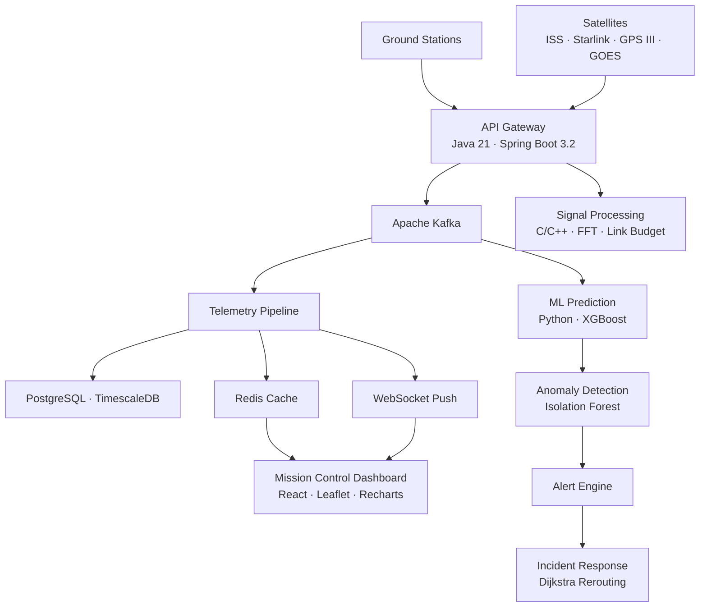

# OrbitLink

Production-grade satellite network operations platform. Real-time telemetry streaming, predictive link failure detection, automated traffic rerouting, and mission control visualization.

Built with a polyglot microservices architecture — Java, Python, C, C++, JavaScript.

---

## Architecture



---

## Tech Stack

| Layer | Technology |
|-------|-----------|
| Backend API | Java 21, Spring Boot 3.2 |
| Streaming | Apache Kafka |
| Database | PostgreSQL, TimescaleDB |
| Cache | Redis |
| ML Service | Python, FastAPI, XGBoost, scikit-learn |
| Simulation | Python, SGP4 |
| Signal Processing | C, C++ |
| Dashboard | React, Recharts, Leaflet |
| Edge Processing | Python |
| Infrastructure | Docker, Terraform, GitHub Actions |
| Observability | Prometheus, Grafana |

---

## Features

**Telemetry Pipeline** — Kafka-backed ingestion with consumer groups for horizontal scaling. Redis caching for sub-millisecond latest-state lookups. WebSocket STOMP push to the dashboard.

**AI-Driven Prediction** — XGBoost link failure classifier and Isolation Forest anomaly detector trained on synthetic physics-based signal data. Batch prediction endpoint for fleet-wide assessment.

**Orbital Simulation** — SGP4 propagation using real NORAD TLE data. ECI-to-geodetic coordinate conversion, ground station visibility, free-space path loss, atmospheric attenuation, and Doppler modeling. Six failure scenarios for stress testing.

**Signal Processing (C/C++)** — Health scoring, Friis path loss, Doppler shift, link budget analysis, BER computation for M-QAM, Cooley-Tukey FFT, sigma-threshold anomaly detection, moving average and exponential smoothing filters. Thread-safe C++ ring buffer and trend analysis with linear regression.

**Automated Incident Response** — Rule-based anomaly triggers, Dijkstra-style graph routing for traffic rerouting, incident lifecycle management, resolution time tracking, and SLA compliance reporting.

**Mission Control Dashboard** — Dark-theme operator console with interactive satellite map, live telemetry charts, fleet health overview, alert management, and one-click incident rerouting.

**Security** — JWT authentication with BCrypt hashing, role-based access control (Operator, Admin, Analyst), Spring Security filter chain. All secrets loaded exclusively from environment variables.

---

## Project Structure

```
orbitlink/
├── packages/
│   ├── api/                    Java Spring Boot backend
│   ├── dashboard/              React frontend
│   ├── simulation/             Python orbital simulation
│   ├── ml-service/             Python ML prediction service
│   ├── signal-processing/      C/C++ signal processing library
│   ├── edge-node/              Python edge telemetry preprocessor
│   └── chaos/                  Chaos engineering runner
├── terraform/                  AWS infrastructure (VPC, RDS, S3, Kinesis)
├── .github/workflows/          CI/CD pipeline
├── docker-compose.yml          Full-stack orchestration
├── prometheus/                 Metrics collection
├── grafana/                    Dashboard provisioning
└── nginx/                      Reverse proxy
```

---

## Quick Start

```bash
git clone https://github.com/aryanputta/orbitlink.git
cd orbitlink
cp .env.example .env       # configure secrets
docker-compose up --build  # launches all services
```

| Service | URL |
|---------|-----|
| Dashboard | http://localhost:3000 |
| API | http://localhost:4000 |
| Grafana | http://localhost:3001 |
| Prometheus | http://localhost:9090 |

### Signal Processing (C/C++)

```bash
cd packages/signal-processing
mkdir build && cd build
cmake .. && make
./signal_test             # run test suite
./telemetry_processor     # run C++ processor demo
```

### Simulation

```bash
cd packages/simulation
pip install -r requirements.txt
python -m src.main
```

### ML Service

```bash
cd packages/ml-service
pip install -r requirements.txt
uvicorn src.main:app --port 5000
```

---

## API

| Method | Endpoint | Description |
|--------|----------|-------------|
| POST | `/api/v1/auth/register` | Register operator |
| POST | `/api/v1/auth/login` | Login, returns JWT |
| POST | `/api/v1/telemetry/ingest` | Ingest telemetry via Kafka |
| POST | `/api/v1/telemetry/ingest/batch` | Batch ingest |
| GET | `/api/v1/telemetry/{satId}/latest` | Latest reading (cached) |
| GET | `/api/v1/telemetry/{satId}` | Historical readings |
| GET | `/api/v1/satellites` | List satellites |
| GET | `/api/v1/satellites/{id}/health` | Real-time health score |
| GET | `/api/v1/alerts` | Active alerts |
| POST | `/api/v1/alerts/{id}/acknowledge` | Acknowledge alert |
| GET | `/api/v1/incidents` | Incident history |
| POST | `/api/v1/incidents/{id}/resolve` | Resolve incident |
| POST | `/api/v1/incidents/{id}/reroute` | Trigger traffic reroute |
| GET | `/api/v1/stations` | Ground station network |
| GET | `/api/v1/reports/sla` | SLA compliance report |
| POST | `/predict` | Link failure prediction |
| POST | `/predict/batch` | Fleet-wide prediction |

---

## Testing

```bash
cd packages/api && mvn test                       # Java API
cd packages/signal-processing/build && ./signal_test  # C/C++
cd packages/chaos && python -m src.chaos_runner    # Chaos engineering
```

---

## Infrastructure

```bash
cd terraform
terraform init
terraform plan
terraform apply
```

Provisions VPC, subnets, RDS PostgreSQL, encrypted S3, Kinesis stream, EC2, and security groups on AWS.

GitHub Actions runs lint, test, Docker build, and compose validation on every push.

---

## License

MIT
