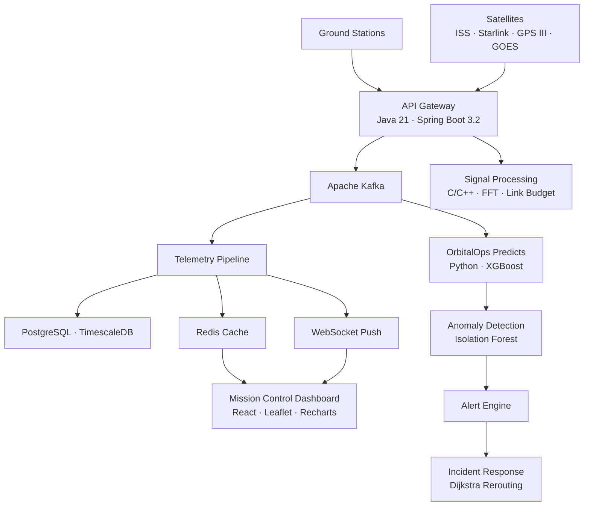

# OrbitalOps

Production-grade satellite network operations platform. Real-time telemetry streaming, predictive link failure detection, automated traffic rerouting, and mission control visualization.

Built with a polyglot microservices architecture — Java, Python, C, C++, JavaScript.

---

## The Problem

Satellite communication networks generate massive volumes of telemetry data across distributed orbital nodes. Operators currently lack the tools to monitor link quality in real time, detect degradation before it causes outages, and respond to connectivity failures across constellations spanning multiple orbits.

OrbitalOps addresses this by creating a platform that collects, analyzes, and visualizes satellite communication telemetry in real time so operators can detect issues earlier and respond faster.

The platform helps by ingesting live telemetry metrics such as latency, packet loss, and bandwidth; aggregating telemetry from multiple orbital nodes; analyzing link quality trends to detect degradation; generating automated alerts when connectivity issues emerge; and providing a real-time dashboard for network situational awareness.

This allows operators to identify failing links earlier, monitor network performance continuously, and maintain more reliable satellite communication across constellations operated by SpaceX (Starlink), Lockheed Martin (GPS III, SBIRS, MUOS), NASA (GOES, TDRS, Landsat), and ESA (Sentinel).

---

## Architecture



---

## Tech Stack

| Layer | Technology |
|-------|-----------|
| Backend API | Java 21, Spring Boot 3.2 |
| Streaming | Apache Kafka |
| Database | PostgreSQL, TimescaleDB |
| Cache | Redis |
| OrbitalOps Predicts | Python, FastAPI, XGBoost, scikit-learn |
| Simulation | Python, SGP4 |
| Signal Processing | C, C++ |
| Dashboard | React, Recharts, Leaflet |
| Edge Processing | Python |
| Infrastructure | Docker, Terraform, GitHub Actions |
| Observability | Prometheus, Grafana |

---

## Features

**Telemetry Pipeline** — Kafka-backed ingestion with consumer groups for horizontal scaling. Redis caching for sub-millisecond latest-state lookups. WebSocket STOMP push to the dashboard.

**OrbitalOps Predicts** — XGBoost link failure classifier and Isolation Forest anomaly detector trained on synthetic physics-based signal data. Batch prediction endpoint for fleet-wide assessment.

**Orbital Simulation** — SGP4 propagation using real NORAD TLE data. ECI-to-geodetic coordinate conversion, ground station visibility, free-space path loss, atmospheric attenuation, and Doppler modeling. Six failure scenarios for stress testing.

**Signal Processing (C/C++)** — Health scoring, Friis path loss, Doppler shift, link budget analysis, BER computation for M-QAM, Cooley-Tukey FFT, sigma-threshold anomaly detection, moving average and exponential smoothing filters. Thread-safe C++ ring buffer and trend analysis with linear regression.

**5G NTN Integration** — Non-terrestrial network link budget analysis, SNR monitoring, bit error rate computation, and adaptive modulation support for satellite-to-ground 5G connectivity.

**Automated Incident Response** — Rule-based anomaly triggers, Dijkstra-style graph routing for traffic rerouting, incident lifecycle management, resolution time tracking, and SLA compliance reporting.

**Live ISS Feed** — Embedded NASA live stream from the International Space Station with real-time ISS position tracking via Open Notify API.

**Mission Control Dashboard** — Dark-theme operator console with interactive satellite map, live telemetry charts, fleet health overview, alert management, and one-click incident rerouting.

**Security** — JWT authentication with BCrypt hashing, role-based access control (Operator, Admin, Analyst), Spring Security filter chain. All secrets loaded exclusively from environment variables.

---

## Project Structure

```
orbitalops/
├── packages/
│   ├── api/                    Java Spring Boot backend
│   ├── dashboard/              React frontend
│   ├── simulation/             Python orbital simulation
│   ├── ml-service/             OrbitalOps Predicts (Python)
│   ├── signal-processing/      C/C++ signal processing library
│   ├── edge-node/              Python edge telemetry preprocessor
│   └── chaos/                  Chaos engineering runner
├── terraform/                  AWS infrastructure (VPC, RDS, S3, Kinesis)
├── .github/workflows/          CI/CD pipeline
├── docker-compose.yml          Full-stack orchestration
├── prometheus/                 Metrics collection
├── grafana/                    Dashboard provisioning
└── nginx/                      Reverse proxy
```

---

## Quick Start

```bash
git clone https://github.com/aryanputta/orbitlink.git
cd orbitlink
cp .env.example .env       # configure secrets
docker-compose up --build  # launches all services
```

| Service | URL |
|---------|-----|
| Dashboard | http://localhost:3000 |
| API | http://localhost:4000 |
| Grafana | http://localhost:3001 |
| Prometheus | http://localhost:9090 |

### Signal Processing (C/C++)

```bash
cd packages/signal-processing
mkdir build && cd build
cmake .. && make
./signal_test             # run test suite
./telemetry_processor     # run C++ processor demo
```

### Simulation

```bash
cd packages/simulation
pip install -r requirements.txt
python -m src.main
```

### OrbitalOps Predicts

```bash
cd packages/ml-service
pip install -r requirements.txt
uvicorn src.main:app --port 5000
```

---

---

## Testing

```bash
cd packages/api && mvn test                       # Java API
cd packages/signal-processing/build && ./signal_test  # C/C++
cd packages/chaos && python -m src.chaos_runner    # Chaos engineering
```

---

## Infrastructure

```bash
cd terraform
terraform init
terraform plan
terraform apply
```

Provisions VPC, subnets, RDS PostgreSQL, encrypted S3, Kinesis stream, EC2, and security groups on AWS.

GitHub Actions runs lint, test, Docker build, and compose validation on every push.

---

## License

MIT
