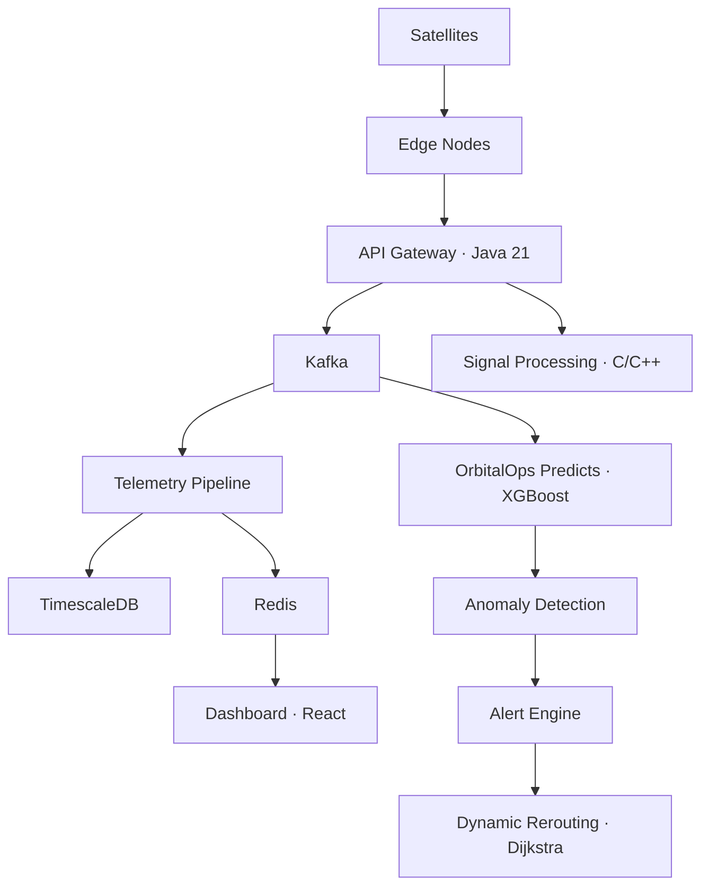

# OrbitalOps

Satellite network operations platform with ML-driven link prediction and 5G-style dynamic routing.

Tracks real constellations: Starlink (SpaceX), GPS III (Lockheed Martin), GOES/TDRS (NASA), Sentinel (ESA).

---

## Problem

Satellite links degrade gradually — signal drops, latency climbs, packet loss fluctuates. Operators notice too late. OrbitalOps detects degradation early using ML prediction and reroutes traffic automatically.

---

## How It Works

**Telemetry ingestion** — Streams latency, packet loss, bandwidth, jitter, signal strength from orbital nodes through Kafka into TimescaleDB.

**OrbitalOps Predicts (ML)** — XGBoost classifier trained on telemetry features:

```
features = [latency_avg, packet_loss, jitter, signal_strength, bandwidth_util, congestion_score]

link_degradation_probability = model.predict(features)  →  0.82

if probability > 0.75 → WARNING
if probability > 0.90 → CRITICAL
```

The model learns patterns like `high latency + rising packet loss → likely degradation`.

**Anomaly detection** — Isolation Forest flags outliers in the feature space. Sigma-threshold detection in C catches spikes in real time.

**5G-style dynamic routing** — When a link degrades, the system computes route scores and switches traffic:

```
route_score = 0.35 * signal + 0.25 * bandwidth + 0.20 * (1/latency) + 0.20 * (1/congestion)
```

Picks the highest-scoring route. Mirrors 5G network slicing and traffic management.

**Edge processing** — Ground station nodes filter noise, compress data, and detect anomalies locally before forwarding to the cloud. Reduces bandwidth, mirrors 5G edge architecture.

---

## Architecture



---

## Tech Stack

| Layer | Tech |
|-------|------|
| API | Java 21, Spring Boot 3.2 |
| Streaming | Kafka |
| Database | PostgreSQL, TimescaleDB |
| ML | Python, XGBoost, Isolation Forest |
| Signal | C, C++ (FFT, link budget, Doppler) |
| Dashboard | React, Leaflet, Recharts |
| Infra | Docker, Terraform, GitHub Actions |

---

## Quick Start

```bash
git clone https://github.com/aryanputta/orbitlink.git
cd orbitlink
cp .env.example .env
docker-compose up --build
```

Dashboard: `http://localhost:3000`

---

## License

MIT
